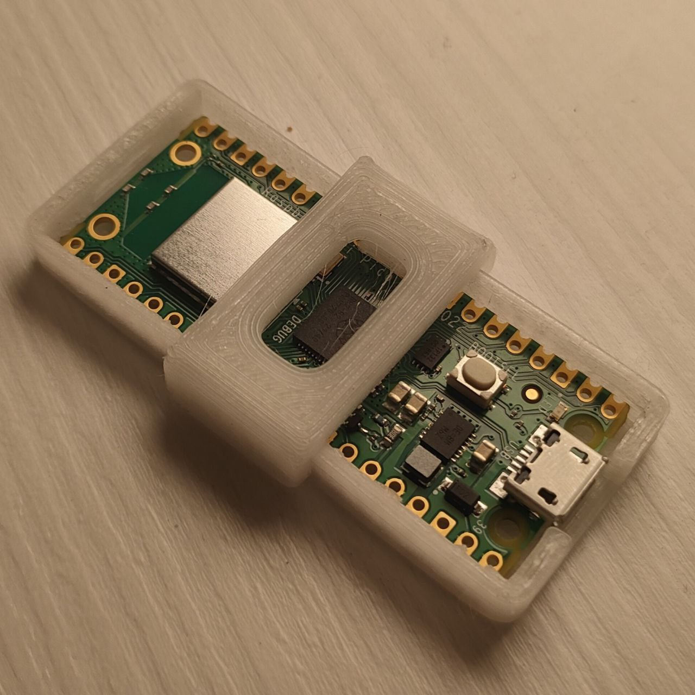
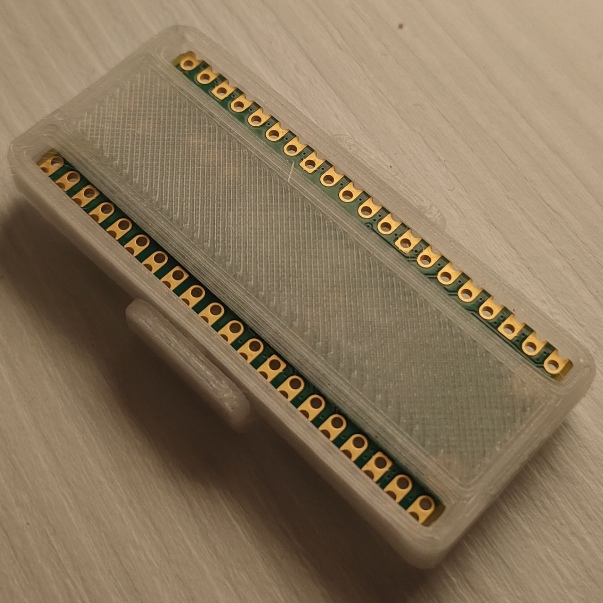

# PicoW_BadUSB
This is a demo project for the internet security course at UniCT.

At the moment the only script in this repo is for MacOs but we're working together with [Lupix111](https://github.com/Lupix111) to make new scripts for multiple platforms and Systems

### platformio
This project is built and tested with platformio but should also work with the ***arduino ide***.

The platformio.ini file includes the [platform](https://github.com/maxgerhardt/platform-raspberrypi.git) I used to program the Raspberry Pi pico W
### 3d printed case
Case by [mason_swiss](https://www.thingiverse.com/thing:4751655) on Thingiverse
FRONT             |  BACK
:-------------------------:|:-------------------------:
  |  

